# CS445_Tour_Into_The_Picture

## Overview
This is the final project for CS445: Computational Photography at UIUC.

Our project, Tour Into The Picture, implements the techniques described in [Tour Into the Picture](http://graphics.cs.cmu.edu/courses/15-463/2011_fall/Papers/TIP.pdf) by Horry et al., reconstructing a 3D model from a single point perspective 2D image.


Team Member:\
Cheung Yau Shing Jonathan (ysc7)\
Yu Bu (yubu2)\
Jiayin Meng (jiayinm2)

## Results 
### Video for our results
https://drive.google.com/file/d/1g1S1EJ2rEcd-o0W2CnsaaFcrHkB42ugX/view?usp=share_link

### Test case 1 with foreground:


#### Foreground extraction and texture synthesis
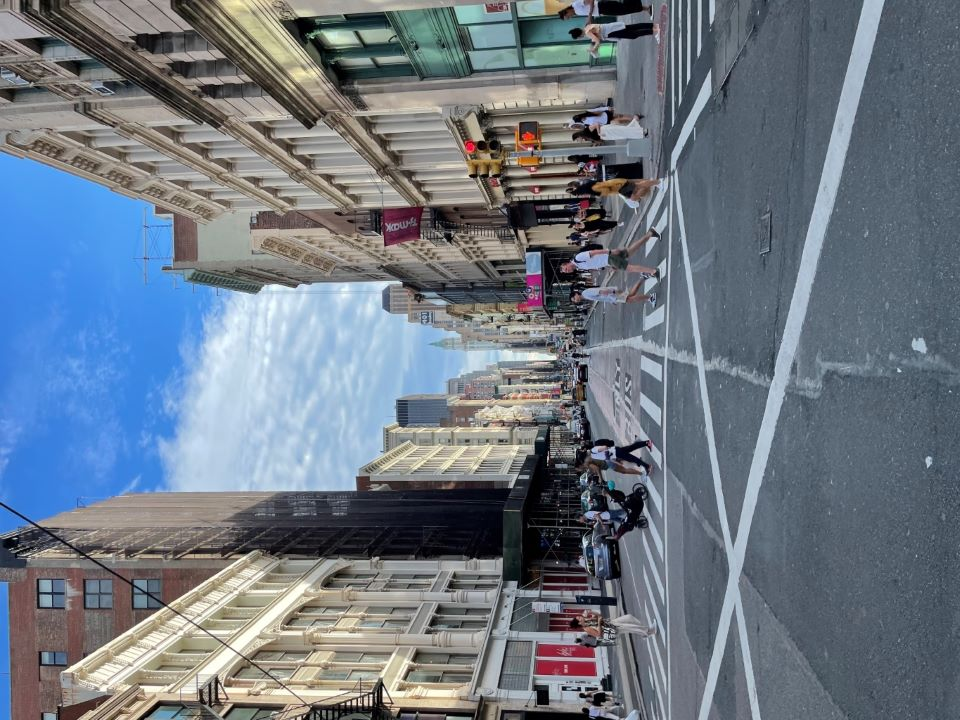 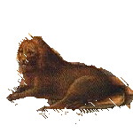

#### Manual input box layout
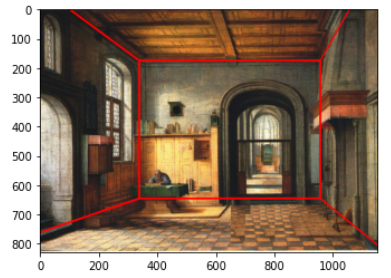

#### Constructing homographies of 5 faces
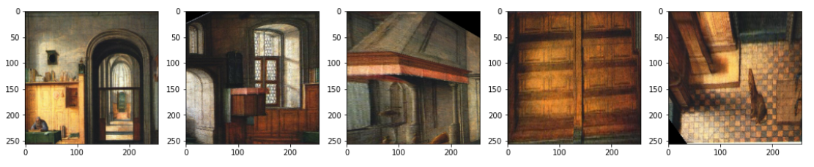

#### Final 3D space at a glance
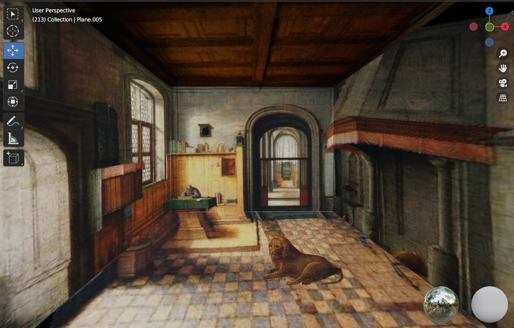


### Test case 2 without foreground:
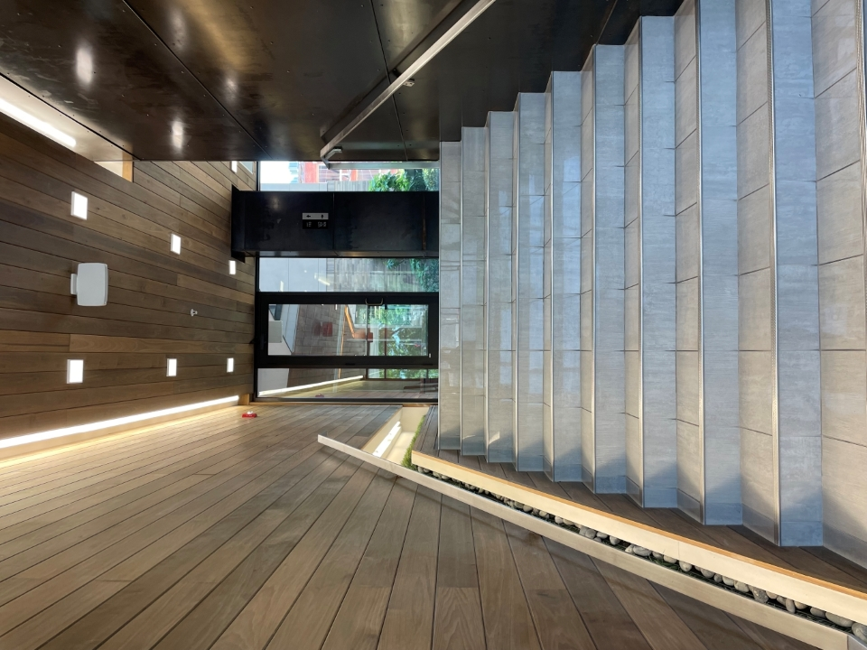

#### Manual input box layout
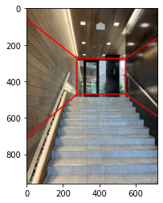

#### Constructing homographies of 5 faces
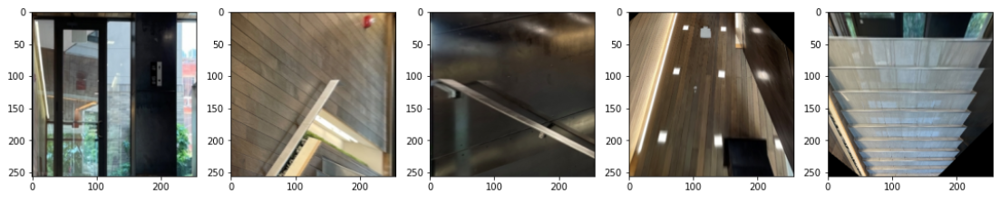

#### Final 3D space at a glance
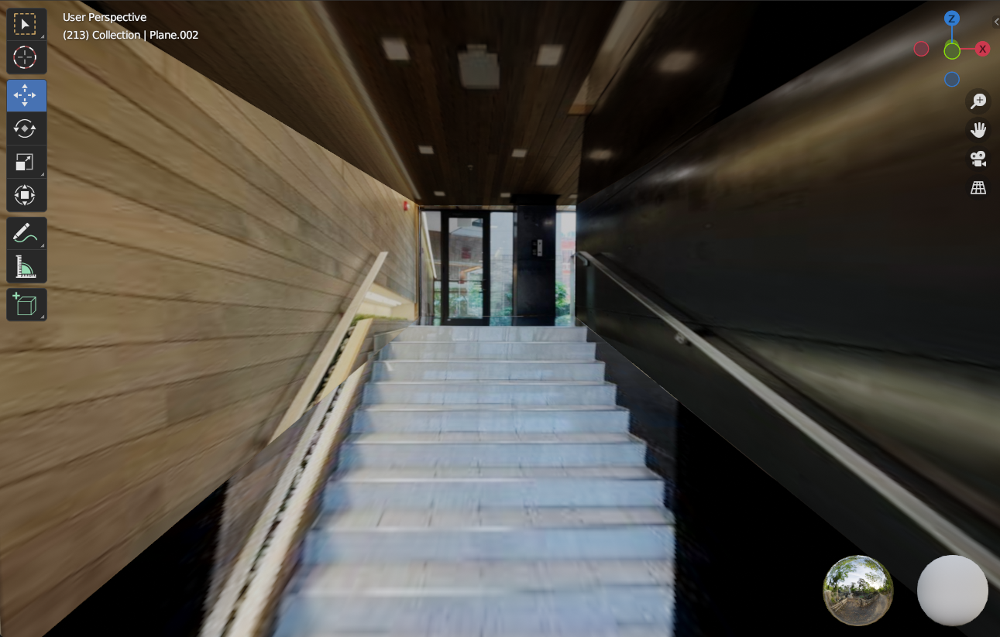


### Test case 3 without foreground:
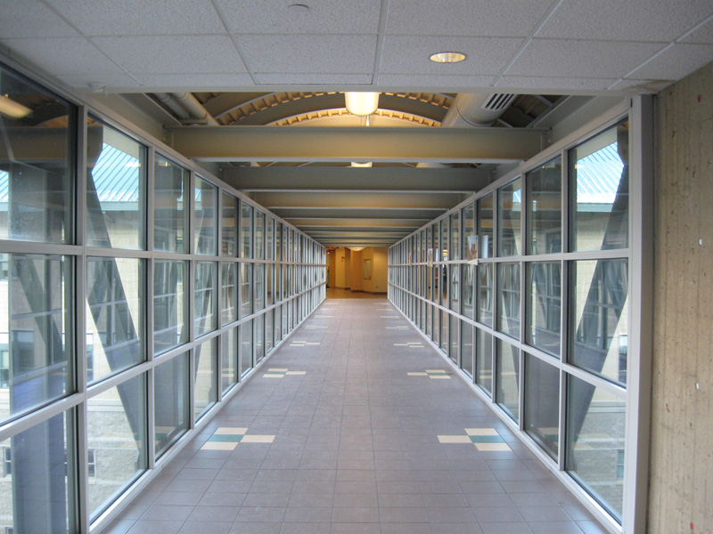

#### Manual input box layout
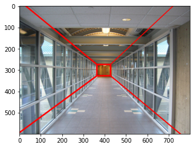

#### Constructing homographies of 5 faces


#### Final 3D space at a glance
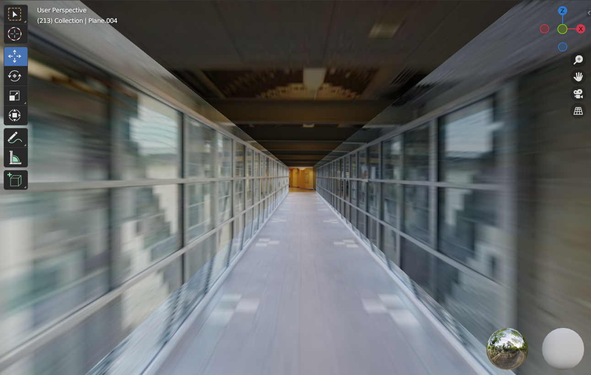

## Directories
### images
contains all the source images
### results
contains all the sub directories of each test cases, in which there are generated homographies, blender objects, and final blender files
contains generated foreground images (with and without parts of the background)
## How to Use
### Get the background and foreground images
Inside the project's directory run:
```
python texture_synthesis.py -i <path to image> --x <starting point X of the mask> --y <starting point Y of the mask> --w <width of the mask> --h <height of the mask> --patch_size <patch size for inpainter>
```
You would get two files named `background.jpg` and `foreground.jpg`.

Then use `foreground.jpg` as the image input of `BackgroundRemoval_Iterative.ipynb` to get the optimal foreground object `foreground.png`.
### Manually specify box layout
In 'main.ipynb':
Choose the source image and specify a 3-point mask (top left, vanishing point, bottom right) by runnning
```
filename = "your image path"
img = cv2.cvtColor(cv2.imread(filename), cv2.COLOR_BGR2RGB).astype('double') / 255.0 

import matplotlib.pyplot as plt
%matplotlib notebook
coords = specify_mask(img)
```
### Generate homographies and 3D spaces
In 'main.ipynb':
Once you have the box layout specified, construct homographies and save blender objects by running
```
coords3D, x_multiplier, depth = construct(coords, "your output folder", img, 1000)
```
If your have a foreground object, load the foreground image, and generate the foregound object by running
```
filename = 'your foreground image'
foreground = cv2.cvtColor(cv2.imread(filename), cv2.COLOR_BGR2RGB).astype('double') / 255.0 
f_coords = foreground_coords(foreground, bottom_right_coord_of_foreground_object)
construct_foreground(foreground, coords, f_coords, "your output folder", coords3D, 1000, x_multiplier, depth)
```
### Use Blender
Once you have run the previous steps, you can create a new blender file insied the output folder.
Then simply import all of the required .obj files.
